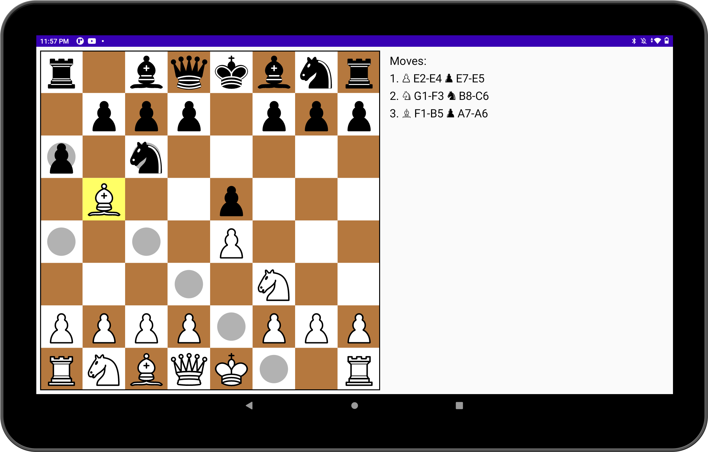

About the project
==================
The main purpose of this project is to learn Jetpack Compose. The goal was to learn how to implement UI with different animations and handle user's gestures.

For the moves validation the [chesslib](https://github.com/bhlangonijr/chesslib) library is used.